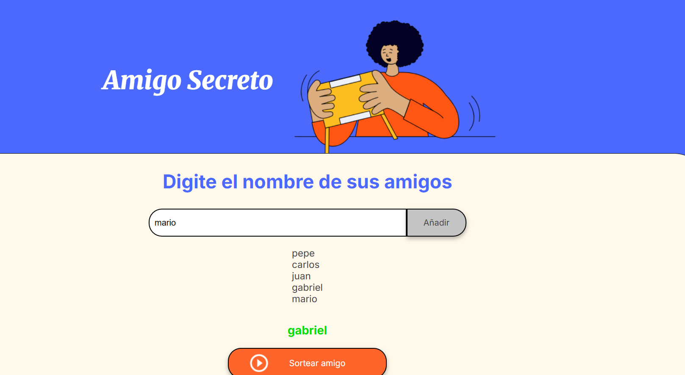

- Challange de amigo secreto

¡Bienvenido! al challenge de amigo secreto de alura, Este es un proyecto de codigo abierto en base al desafio propueto por alura

DETALLES DE LA APP
Es una aplicacion web desarrollada con JavaScript, CSS, HTML la cual permite a los usuarios

-Ingresar nombres
-Vizualizar los nombres ingresados
-Sortea a un amigo de los ombres que agrego el usuario

¿COMO INSTALAR EL PROYECTO?

1.- Clona el reporitorio en tu carpeta seleccionada
git clone https://github.com/Dante5300/Challange-Alura.git

2.- Abre la carpeta del proyecto en tu aditor de codigo

3.- Ejecuta el proyecto con el archivo ```index.html``` en tu navegador web

Vista previa de la aplicacion web



Gracias por visitar este repositorio, puedes mejorar y/o contibuir en este proyecto, ya que es de codigo abierto
